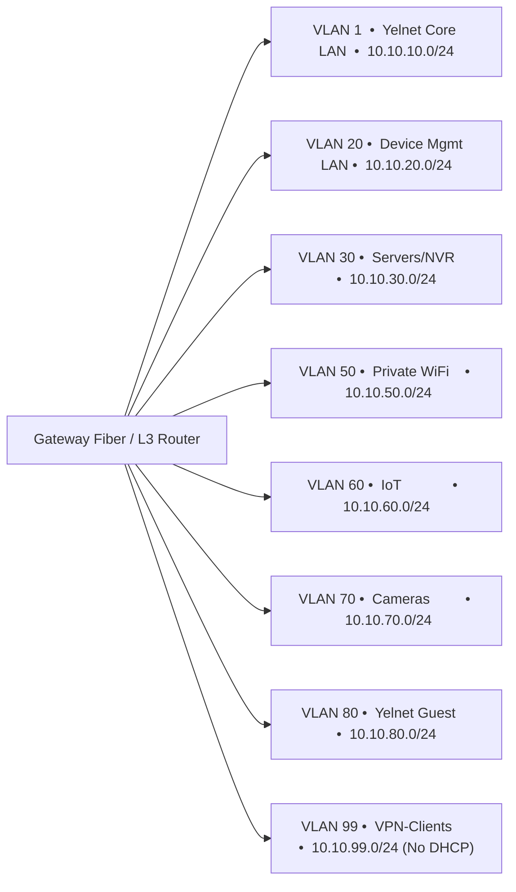
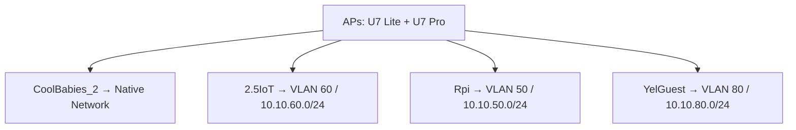

# Dylan — Home Network & Homelab Context (YelNet)

**Last Updated:** 2026-01-28 01:28 UTC
**Purpose:** Network topology, hardware inventory, security architecture, and homelab learning goals

---

## 1) Network Overview & Philosophy

### Network Name
**YelNet** — Dylan's home network infrastructure (segmented, security-first, UniFi-managed)
**BadNich** — Homelab cybersecurity learning environment, airgapped from YelNet `[PLANNED]`

### Operational Philosophy
- Security-first design with proper segmentation
- Learning environment for cybersecurity concepts
- Incremental migration toward enterprise-grade practices
- Balance between functionality and educational value

---

## 2) Current Physical Network Topology

### ISP & Gateway
| Component | Model | Location | Role |
|-----------|-------|----------|------|
| **ISP** | AT&T Internet | — | Primary WAN service |
| **Primary Gateway** | **UniFi Cloud Gateway Fiber** | — | Core router, VLAN gateway, policy enforcement, UniFi controller |

### WAN Interfaces
| WAN | Interface | Port | Link | Status | Address |
|-----|-----------|------|------|--------|---------|
| **WAN1** | WAN1 | **Port 5** | **5 GbE** | **Online / Primary** | IPv4: **192.168.1.146** |
| **WAN2** | WAN2 | **SFP+2** | Auto | **Disconnected / Backup** | — |

### Gateway Fiber — Port Map (L1/L2 Neighbors)
| Gateway Port | Speed | Neighbor | Neighbor IP | Port Profile |
|--------------|-------|----------|-------------|--------------|
| 1 | 2.5 GbE | **Dungeon_Master** | **10.10.10.134** | Yelnet Core LAN |
| 2 | 2.5 GbE | **U7 Lite (AP)** | **10.10.10.166** | Yelnet Core LAN |
| 3 | 2.5 GbE | **USW Flex 2.5G 8 PoE** | **10.10.10.109** | Yelnet Core LAN |
| 4 | 2.5 GbE | **USW Flex 2.5G 5** | **10.10.10.122** | Yelnet Core LAN |
| 5 | 5 GbE | **AT&T Internet** | — | — |
| SFP+1 | Auto | — | — | None |
| SFP+2 | Auto | WAN2 Backup | — | — |

### Distribution Layer

#### USW Flex 2.5G 8 PoE (10.10.10.109)
| Switch Port | Speed | Neighbor | Neighbor IP | Port Profile |
|-------------|-------|----------|-------------|--------------|
| 4 | 1 GbE | **NVR** | **10.10.10.140** | Yelnet Core LAN |
| 7 | 2.5 GbE | **U7 Pro (AP)** | **10.10.10.125** | Yelnet Core LAN |
| 9 | 2.5 GbE | **Gateway Fiber (uplink)** | **10.10.10.1** | Yelnet Core LAN |

#### USW Flex 2.5G 5 (10.10.10.122)
| Switch Port | Speed | Neighbor | Neighbor IP | Port Profile |
|-------------|-------|----------|-------------|--------------|
| 1 | 1 GbE | **597QK24 d1:98** | **10.10.80.39** | **Yelnet Guest** |
| 2 | FE (100 Mb) | **A&H Qu-5D** | **10.10.10.190** | Yelnet Core LAN |
| 5 | 2.5 GbE | **Gateway Fiber (uplink)** | **10.10.10.1** | Yelnet Core LAN |

### Wireless Infrastructure & Associations
- **U7 Lite** (10.10.10.166) — wired @ 2.5 GbE to Gateway Fiber **Port 2**
- **U7 Pro** (10.10.10.125) — wired @ 2.5 GbE to **USW Flex 2.5G 8 PoE Port 7**
- **G6 Instant** (10.10.10.127, Protect) — **Parent Device = U7 Pro** (wireless association)

### Unused Devices Available for Lab or Home Network
- **Archer AX6000 WiFi 6 Router** `[AVAILABLE]`
- **USW Ultra 60W Switch** `[AVAILABLE]`
- **UniFi Gateway Ultra** `[AVAILABLE]`

### Network Topology Summary
```
[AT&T Internet]
     |
     |  WAN1 (5 GbE) — Gateway Fiber Port 5
     v
[UniFi Cloud Gateway Fiber 10.10.10.1]
     |-- Port 1 (2.5GbE) --> [Dungeon_Master 10.10.10.134]
     |-- Port 2 (2.5GbE) --> [U7 Lite 10.10.10.166]
     |-- Port 3 (2.5GbE) --> [USW Flex 2.5G 8 PoE 10.10.10.109]
     |                        |-- Port 4 (1GbE)   --> [NVR 10.10.10.140]
     |                        |-- Port 7 (2.5GbE) --> [U7 Pro 10.10.10.125]
     |                                           `--> (Wi-Fi) [G6 Instant 10.10.10.127]
     |
     `-- Port 4 (2.5GbE) --> [USW Flex 2.5G 5 10.10.10.122]
                              |-- Port 2 (FE)    --> [A&H Qu-5D 10.10.10.190]
                              `-- Port 1 (1GbE)  --> [Guest device 10.10.80.39]
```

### Topology Summary (Mermaid)

```mermaid
graph TD
  ISP[AT&T Internet] -->|WAN1 / Gateway Port 5 (5GbE)| UGF[UniFi Cloud Gateway Fiber\n10.10.10.1]

  UGF -->|Port 1 (2.5GbE)| DM[Dungeon_Master\n10.10.10.134]
  UGF -->|Port 2 (2.5GbE)| U7L[U7 Lite\n10.10.10.166]
  UGF -->|Port 3 (2.5GbE)| SW8[USW Flex 2.5G 8 PoE\n10.10.10.109]
  UGF -->|Port 4 (2.5GbE)| SW5[USW Flex 2.5G 5\n10.10.10.122]

  SW8 -->|Port 4 (1GbE)| NVR[NVR\n10.10.10.140]
  SW8 -->|Port 7 (2.5GbE)| U7P[U7 Pro\n10.10.10.125]
  U7P -.->|Wi-Fi association| G6[G6 Instant\n10.10.10.127]

  SW5 -->|Port 2 (FE)| QU[A&H Qu-5D\n10.10.10.190]
  SW5 -->|Port 1 (1GbE)| DEV80[Guest device\n10.10.80.39\n(VLAN 80)]
```

---

## 3) Current Logical Network Topology (VLANs / Subnets / DHCP)

All routed by **Gateway Fiber**.

| Network Name | VLAN ID | Subnet | DHCP |
|--------------|---------|--------|------|
| **YelNet Core LAN** | 1 | **10.10.10.0/24** | Server |
| **YelNet Device Mgmt LAN** | 20 | **10.10.20.0/24** | Server |
| **Servers/NVR** | 30 | **10.10.30.0/24** | Server |
| **Private WiFi** | 50 | **10.10.50.0/24** | Server |
| **IoT** | 60 | **10.10.60.0/24** | Server |
| **Cameras** | 70 | **10.10.70.0/24** | Server |
| **YelNet Guest** | 80 | **10.10.80.0/24** | Server |
| **VPN-Clients** | 99 | **10.10.99.0/24** | **None** |

### Evidence Callout (Port-Profile → Subnet Consistency)
- **USW Flex 2.5G 5 Port 1** is assigned **Profile = Yelnet Guest** and the connected host has IP **10.10.80.39**, matching **VLAN 80 / 10.10.80.0/24**.

### Logical Segmentation (Mermaid)


---

## 4) Wi-Fi (SSIDs → Networks)

Broadcasting scope shown: **All APs**.

| SSID | Mapped Network | Bands | Security | Clients (snapshot) |
|------|----------------|-------|----------|--------------------|
| **CoolBabies_2** | Native Network | 5 GHz, 6 GHz | WPA2/WPA3 | 6 |
| **2.5IoT** | **IoT (VLAN 60)** | 2.4 GHz | WPA2 | 5 |
| **Rpi** | **Private WiFi (VLAN 50)** | 2.4 GHz, 5 GHz | WPA2/WPA3 | — |
| **YelGuest** | **Yelnet Guest (VLAN 80)** | 5 GHz, 6 GHz | WPA3 | — |

Wi-Fi Mapping (Mermaid):


---

## 5) VPN Client (WireGuard) Profiles

| Name | Type | Tunnel IP (/32) | Server | Port | Status |
|------|------|-----------------|--------|------|--------|
| Proton-WG-Frankfurt | WireGuard | 10.2.0.2/32 | 149.88.102.46 | 51820 | Not Connected |
| US_West_SanJose | WireGuard | 10.2.0.10/32 | 79.127.185.222 | 51820 | Not Connected |
| US-Denver | WireGuard | 10.2.0.20/32 | 95.173.221.65 | 51820 | Not Connected |

---

## 6) UniFi Device Inventory (Snapshot)

| Name | App | Status | IP | Uplink | Parent |
|------|-----|--------|-----|--------|--------|
| Gateway Fiber | Network | Online | **10.10.10.1** | 5 GbE | AT&T Internet |
| USW Flex 2.5G 5 | Network | Up to date | **10.10.10.122** | 2.5 GbE | Gateway Fiber Port 4 |
| USW Flex 2.5G 8 PoE | Network | Up to date | **10.10.10.109** | 2.5 GbE | Gateway Fiber Port 3 |
| USW Ultra 60W | Network | Offline | **10.10.10.112** | — | Offline |
| U7 Lite | Network | Up to date | **10.10.10.166** | 2.5 GbE | Gateway Fiber Port 2 |
| U7 Pro | Network | Up to date | **10.10.10.125** | 2.5 GbE | USW Flex 2.5G 8 PoE Port 7 |
| G6 Instant | Protect | Online | **10.10.10.127** | — | **U7 Pro** |

---

## 7) Security & Surveillance Infrastructure

### Reolink Camera System
| Component | Model | Quantity/Capacity | Purpose |
|-----------|-------|-------------------|---------|
| **Camera Kit** | Reolink RLK8-1200B4-A | 8-camera system | Exterior/perimeter monitoring |
| **NVR** | Reolink RLN8-410 | 8-channel, 2TB HDD | Recording and management |
| **Doorbell** | Reolink PoE doorbell | 1 unit | Front door monitoring |

**Current Configuration:**
- Cameras currently installed indoors (temporary)
- **Planned:** Move cameras to outdoor mounting points
- NVR connected to network via **10.10.10.140** on VLAN 1 (Core LAN)
- Future: Migrate to dedicated **Cameras VLAN 70 (10.10.70.0/24)**

**Integration Status:**
- Reolink app access: `[ACTIVE]`
- UniFi Protect integration: `[NOT CONFIGURED]`

---

## 8) Homelab Infrastructure & Cybersecurity Learning Environment

### Homelab Hosts
| Machine | OS | Role | Location |
|---------|-----|------|----------|
| **Dungeon_Master** | Windows 11 Pro | Hyper-V host, primary workstation | Home office |
| **Surface Book Gen 1** | AlmaLinux 9.6 (RHEL-Based) | Bare metal Linux learning | Mobile |
| **Old Desktop PC** | `[PLANNED]` | Planned for lab use | Storage |
| **ClockworkPi uConsole** | Debian-Based OS Fork & Parrot Security OS | Portable Linux experiments and pen testing | Mobile |
| **Lenovo ThinkPad E14** | Windows 11 Home | General use, portable dev work | Mobile |

#### Hyper-V Virtual Machines (Dungeon_Master)
| VM Name | OS | Purpose |
|---------|-----|---------|
| AlmaLinux 10 | AlmaLinux 10 (RHEL-Based) | Linux server/development environment |
| Windows Test VM | Windows | Testing, sandbox |
| Kali Linux VM | Kali Linux | Penetration testing and offensive security |
| Parrot OS VM | Parrot Security | Security testing, OSINT |
| WSL 2 | Ubuntu 22.04 LTS | Linux command-line tools on Windows |
| *(Expansion capacity available)* | — | — |

#### Hyper-V Virtual Machines (Workbox)
| VM Name | OS | Purpose |
|---------|-----|---------|
| AlmaLinux 9 VM | AlmaLinux 9.6 (RHEL-Based) | Linux server/development environment |
| Kali Purple VM | Kali Linux | Defensive security (Purple Team) |
| Parrot OS VM | Parrot Security | Security testing, OSINT |
| Windows Test VM 1 | Windows | Testing, development |
| Windows Test VM 2 | Windows | Testing, sandbox |

### Cybersecurity Learning Focus Areas

**Current Learning Trajectory:**
- Network fundamentals: DHCP → DNS (wants "slow and methodical" deep dive) — see IT context doc
- Network segmentation via VLANs
- Firewall policy design and implementation
- IDS/IPS concepts (Snort, Security Onion interest)
- DFIR (Digital Forensics and Incident Response) mindset
- Lab isolation and safe testing environments

**Homelab Goals:**
- Hands-on practice with enterprise network patterns
- Malware analysis in isolated environment
- Blue team monitoring and detection
- Vulnerability scanning and assessment
- Packet capture and traffic analysis

---

## 9) Remote Access & VPN Planning

### VPN Requirements
- Secure remote access to home network
- Access to homelab VMs from external networks
- Split-tunnel vs full-tunnel decision needed
- Authentication method (certificates, MFA)
- Have a Proton VPN Subscription and WireGuard experience
- Prefer modern, lightweight solutions
- Have not implemented inbound VPN yet

### Outbound  VPN
| Solution | Status | Notes |
|----------|--------|-------|
| WireGuard | `[IMPLEMENTED]` | Modern, performant, simple configuration |
| UniFi VPN | `[NOT CONFIGURED]` | Native integration with UniFi Gateway |
| OpenVPN | `[NOT CONFIGURED]` | Industry standard, more complex |

---

## 10) Monitoring & Management Infrastructure

### Network Monitoring Goals
- Real-time traffic visibility with self-hosted SIEM
- Anomaly detection
- Performance metrics
- Historical logging

### Planned Capabilities
- `[UNFINISHED]` Central logging solution (syslog server, SIEM)
- `[UNFINISHED]` Network monitoring dashboard (UniFi Network Application, Grafana)
- `[UNFINISHED]` Alerting for security events
- `[UNFINISHED]` Bandwidth monitoring and QoS

---

## 11) Backup & Data Management

### Current Backup Strategy
**Status:** `[PLANNED]` / Planning Stage

**Needs Assessment:**
- Primary machine (Dungeon_Master) backup targets
- VM backup and snapshot strategy
- Network configuration backups
- Camera footage retention policy
- 3-2-1 backup rule implementation

---

## 12) Future Homelab Expansion Ideas

### Short-Term Goals
- Complete UniFi gateway and switch deployment
- Move Reolink cameras to outdoor mounting points and connect to NVR
- Begin setup and deployment of homelab for cybersecurity learning
- Implement VLANs and firewall policies

### Medium-Term Goals
- Begin Learning Containerization (Docker, Kubernetes basics)
- Begin Learning Ansible for automation of new deployments
- Set up dedicated homelab server (potential NAS or dedicated host)
- Implement central logging and monitoring
- Deploy segmented VLAN for penetration testing, Blue Team exercises, and enterprise networking concepts
- Build malware analysis lab/Detonation Chamber (isolated VM environment)
- Deploy IDS/IPS for traffic inspection
- Create "attack/defend" scenarios for learning

### Long-Term Vision
- Kubernetes cluster for container learning
- Software-defined networking (SDN) exploration
- Home automation integration with proper security
- Penetration testing lab with vulnerable VMs (HackTheBox-style)
- Network simulation for enterprise scenario practice

---

## 13) Louis Art Installation Project (Data Privacy Concept)

### Project Overview
**Collaborator:** Louis (art and sound projects partner)

**Concept:** Interactive art installation exploring surveillance capitalism and data collection

### Technical Requirements `[BRAINSTORMING]`

**Core Functionality:**
1. **Captive Portal WiFi VLAN**
   - Users connect to dedicated VLAN WiFi SSID
   - Captive portal landing page explaining data collection
   - End User License Agreement (EULA) for data collection consent
   - Legal compliance framework for data collection

2. **Data Collection Architecture**
   - WiFi/network metadata (signal strength, connection patterns)
   - Browser fingerprinting (if legally permissible with consent)
   - Social media integration (Instagram API, within ToS limits)
   - Simulate data broker collection methods
   - Pull legal data from any scrapable sources on people's devices that opt-in to the experience over WiFi

3. **Data Visualization Dashboard**
   - Real-time display of collected data
   - Demonstrate what "surveillance capitalism" captures
   - Local display for participants to see their data

4. **Interactive Audio Component**
   - WiFi/cellular signal → audio parameter mapping
   - Presence detection triggering sound
   - Synthesizer engine controlled by user data
   - Spatial interaction based on device signals

### Technical Stack Considerations
- **Platform:** TBD (evaluating Linux/Windows options)
- **Captive Portal Software:** TBD
- **Data Processing:** TBD
- **Audio Engine:** TBD (evaluating JUCE, Max/MSP, Pure Data)
- **Visualization:** TBD (considering React/D3.js, TouchDesigner)

### Open Questions
- Legal framework for consent-based data collection in art context
- How to clearly communicate "you are being surveilled" to participants
- Technical feasibility of social media integration within platform ToS
- Infrastructure requirements (dedicated router, VLAN setup, hardware)
- Audio synthesis mapping strategies based on collected data
- User experience flow from connection to data visualization and audio interaction
- How to begin architecting the captive portal and data collection backend
- How to anonymize data while still demonstrating surveillance concepts
- Want to avoid PII collection entirely, focus on metadata and behavioral patterns like marketing and ad tech companies do

**Status:** `[BRAINSTORMING]` — Conceptual planning phase, technical requirements need refinement and resource gathering

---

## 14) Documentation Gaps & UNKNOWN Items

The following network details are **undocumented & not implemented:**

### IP Addressing & Subnets
- DHCP scope ranges and reservations
- Static IP assignments for critical devices

### Physical Infrastructure
- No Topology design for the **BadNich** homelab VLAN yet

### Firewall & Security Policies
- Inter-VLAN routing rules
- Port forwarding requirements
- NAT configuration
- IDS/IPS rule sets

### Management & Access
- Out-of-band management access
- Recovery procedures for network outages

---

## Notes for LLMs Using This Context

- **YelNet is in transition:** Current state is setup & operational, but not fully finalized
- **Security-first mindset:** Never suggest configurations that increase attack surface
- **Learning environment:** Homelab is for education, not just production functionality
- **UniFi bias:** Dylan is operating a UniFi ecosystem, prefer UniFi-specific guidance when relevant
- **Ask about unknowns:** Many network details (VLANs, IPs, firewall rules) are not yet defined—ask rather than assume
- **Cross-references:** See CS context doc for data collection and audio synthesis learning goals (Louis project), IT context doc for DNS deep dive and PowerShell automation, Audio context doc for synthesis and TouchDesigner requirements
