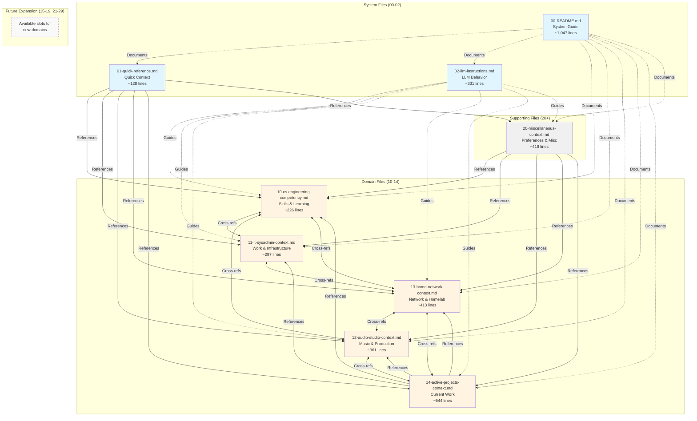

# File Relationship Diagram

**Purpose:** Visual guide to understand how the 9 core files connect and reference each other

---

## File Architecture Overview



---

## File Dependencies Legend

**Line Types:**
- **Solid arrows (→):** Direct cross-references in "Notes for LLMs" sections
- **Dashed arrows (-.->):** Structural/organizational relationships
- **Double arrows (↔):** Bidirectional cross-references

**Color Coding:**
- 🔵 **Blue:** System/meta files (00-02)
- 🟡 **Yellow:** Domain-specific context files (10-14)
- ⚪ **Gray:** Supporting/miscellaneous files (20+)
- ⬜ **White (dashed):** Available expansion slots

---

## Usage Flow by Query Type

### For Software Development Questions
```
User Query → 01-quick-reference.md → 10-cs-engineering-competency.md
                                    → 02-llm-instructions.md (optional)
```

### For IT/Work Questions
```
User Query → 01-quick-reference.md → 11-it-sysadmin-context.md
                                    → 13-home-network-context.md (if homelab related)
```

### For Music Production Questions
```
User Query → 01-quick-reference.md → 12-audio-studio-context.md
                                    → 14-active-projects-context.md (if project-specific)
```

### For Network/Homelab Questions
```
User Query → 01-quick-reference.md → 13-home-network-context.md
                                    → 11-it-sysadmin-context.md (if IT related)
```

### For Project Management Questions
```
User Query → 01-quick-reference.md → 14-active-projects-context.md
                                    → Relevant domain files (10-13)
```

---

## File Update Frequency Guide

| Update Frequency | Files |
|------------------|-------|
| **Weekly-Monthly** | 14-active-projects-context.md |
| **Monthly** | 01-quick-reference.md, 11-it-sysadmin-context.md, 13-home-network-context.md |
| **Quarterly** | 10-cs-engineering-competency.md |
| **Rarely** | 00-README.md, 02-llm-instructions.md, 12-audio-studio-context.md, 20-miscellaneous-context.md |

---

## Token Budget by Combination

| Use Case | Files Loaded | Approx. Tokens | LLM Compatibility |
|----------|--------------|----------------|-------------------|
| Quick intro | 01 only | ~950 | All LLMs |
| Software dev | 01 + 10 | ~2,650 | All LLMs |
| IT work | 01 + 11 | ~3,150 | All LLMs |
| Audio production | 01 + 12 | ~3,650 | All LLMs |
| Network/homelab | 01 + 13 | ~4,050 | All LLMs |
| Project planning | 01 + 14 | ~5,050 | All LLMs |
| Multi-domain | 01 + 10 + 11 | ~4,850 | All LLMs |
| Comprehensive | 01 + 10-14 + 20 | ~17,300 | Most LLMs (128k+ context) |

---

## Expansion Strategy

### Available Number Slots

**Domain Files (10-19):**
- 10: CS Engineering ✅
- 11: IT/Sysadmin ✅
- 12: Audio Studio ✅
- 13: Home Network ✅
- 14: Active Projects ✅
- **15-19: AVAILABLE** (5 slots)

**Supporting Files (20-29):**
- 20: Miscellaneous ✅
- **21-29: AVAILABLE** (9 slots)

### Example Future Domains

**Potential 15-19 domains:**
- 15-photography-context.md
- 16-fitness-health-context.md
- 17-language-learning-context.md
- 18-investing-finance-context.md
- 19-travel-logistics-context.md

**Potential 21-29 supporting files:**
- 21-plugins-inventory.md
- 22-keyboard-shortcuts.md
- 23-bookmarks-resources.md
- 24-project-templates.md
- 25-code-snippets.md

---

## Best Practices

### When to Create New Domain File (15-19)

✅ **Create new domain if:**
- Topic has 300+ words of unique content
- Topic is rarely used with other domains
- Topic has distinct hardware/tools/workflows
- You'll update it on different schedule than existing files

❌ **Don't create new domain if:**
- Content fits in existing domain file
- Topic is closely related to existing domain
- Less than 300 words total content
- Would always be loaded with another domain file

### When to Split Existing Domain File

Split if file exceeds:
- **2,000 words** (~500 lines)
- **Multiple distinct sub-topics** rarely used together

Example split:
```
Before: 12-audio-studio-context.md (2,500 words)

After:
- 12a-audio-hardware-context.md (800 words)
- 12b-audio-workflows-context.md (900 words)  
- 12c-audio-projects-context.md (600 words)
```

---

## Quick Reference

**Always start with:** 01-quick-reference.md  
**Add domain files:** Based on query topic  
**Include instructions:** 02-llm-instructions.md (if LLM not following preferences)  
**Check cross-references:** Follow to related domains as needed

**Total system size:** ~20,350 tokens (fits in most LLM context windows)
