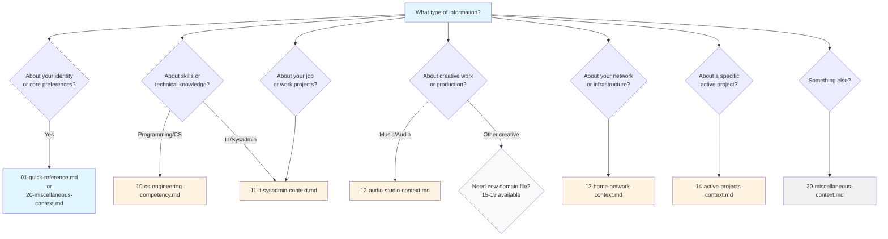

# Decision Tree: Where Does This Information Go?

**Purpose:** Quick guide to determine which file should contain specific information

---

## START HERE: What type of information are you adding?



---

## Detailed Decision Flowchart

### Step 1: Identify Information Category

**Ask yourself:**

1. **Is this about WHO I am?** → Go to Section A
2. **Is this about WHAT I know/can do?** → Go to Section B
3. **Is this about WHERE I work/create?** → Go to Section C
4. **Is this about WHEN/WHAT I'm currently doing?** → Go to Section D
5. **Is this about HOW I prefer things?** → Go to Section E
6. **Is this something else?** → Go to Section F

---

## Section A: WHO I Am (Identity Information)

### Quick Decision Matrix

| Information Type | Goes In | Example |
|------------------|---------|---------|
| Name, role, employer | 01-quick-reference.md | "Dylan — Computer Support Analyst at..." |
| Machine names/specs | 01-quick-reference.md | "Workbox: Dell i7..." |
| Location, timezone | 20-miscellaneous-context.md | "Little Rock, Arkansas, Central Time" |
| Career trajectory | 20-miscellaneous-context.md | "Moving toward systems engineering..." |
| Personal interests (general) | 20-miscellaneous-context.md | "Music production, film scoring" |
| Collaboration partners | 20-miscellaneous-context.md | "Louis: art installation partner" |

**Rule of thumb:** If it fits in 1-2 sentences → File 01. If needs explanation → File 20.

---

## Section B: WHAT I Know/Can Do (Skills & Knowledge)

### Flowchart

```
Is it programming/CS related?
├─ YES → Does it involve work/production systems?
│  ├─ YES → 11-it-sysadmin-context.md (e.g., PowerShell scripting)
│  └─ NO → 10-cs-engineering-competency.md (e.g., C++ proficiency)
│
└─ NO → Is it creative/production skill?
   ├─ Music/audio → 12-audio-studio-context.md
   ├─ Network/infrastructure → 13-home-network-context.md
   └─ Other → Consider new domain file (15-19) or 20-miscellaneous
```

### Specific Examples

| Skill/Knowledge | Goes In | Why |
|-----------------|---------|-----|
| C++ proficiency level | 10-cs-engineering-competency.md | Programming skill |
| PowerShell scripting | 11-it-sysadmin-context.md | IT work skill |
| Pro Tools workflows | 12-audio-studio-context.md | Audio production skill |
| VLAN configuration | 13-home-network-context.md | Network skill |
| Git repository governance | 11-it-sysadmin-context.md | IT work skill |
| FFmpeg video editing | 10-cs-engineering-competency.md OR 12-audio-studio-context.md | Cross-domain: choose primary use |

---

## Section C: WHERE I Work/Create (Environment & Tools)

### Decision Tree

```
What environment is this about?

Work IT Infrastructure
└─ 11-it-sysadmin-context.md
   Examples: Windows Server, Active Directory, work network

Home Network
└─ 13-home-network-context.md
   Examples: Router, switches, VLANs, UniFi devices

Audio Studio
└─ 12-audio-studio-context.md
   Examples: Synths, mixer, DAW setup, cables

Development Environment
├─ Programming/CS → 10-cs-engineering-competency.md
└─ IT/scripting → 11-it-sysadmin-context.md

Physical Workspace
└─ 20-miscellaneous-context.md
   Examples: Desk setup, monitors, peripherals (if not domain-specific)
```

### Hardware Placement Guide

| Hardware Type | Primary File | Secondary File (if relevant) |
|---------------|--------------|------------------------------|
| Work laptop/desktop | 01-quick-reference.md | 11-it-sysadmin-context.md (if work-specific details) |
| Home desktop/laptop | 01-quick-reference.md | Domain file where primarily used |
| Network equipment | 13-home-network-context.md | — |
| Audio equipment | 12-audio-studio-context.md | — |
| Virtual machines | 13-home-network-context.md | Domain file if domain-specific purpose |
| Development tools | 10-cs-engineering-competency.md OR 11-it-sysadmin-context.md | Depends on primary use |

---

## Section D: WHEN/WHAT I'm Currently Doing (Active Work)

### Simple Rule

**All active projects → 14-active-projects-context.md**

Then cross-reference from domain files if needed.

### Examples

| Project | Primary File | Cross-Reference From |
|---------|--------------|----------------------|
| Git repository implementation | 14-active-projects-context.md | 11-it-sysadmin-context.md |
| Louis art installation | 14-active-projects-context.md | 12-audio-studio-context.md, 13-home-network-context.md |
| Ambient synth album | 14-active-projects-context.md | 12-audio-studio-context.md |
| Homelab cybersecurity learning | 14-active-projects-context.md | 13-home-network-context.md |
| Contra NES game (past project) | 14-active-projects-context.md | 10-cs-engineering-competency.md (as evidence of skill) |

### When to Also Update Other Files

Update **01-quick-reference.md** if:
- Project changes priority order
- Project becomes new #1 priority
- Project completes (remove from active list)

Update **domain file** if:
- Project requires new hardware/tools (add to inventory)
- Project demonstrates new skill (add to competency section)
- Project changes infrastructure (update topology/config)

---

## Section E: HOW I Prefer Things (Preferences & Patterns)

### Decision Matrix

| Preference Type | Goes In | Example |
|-----------------|---------|---------|
| Communication style | 02-llm-instructions.md | "Expert mentor tone" |
| Code style | 02-llm-instructions.md | "Full descriptive names" |
| Security mindset | 02-llm-instructions.md | "Never increase attack surface" |
| Teaching style | 02-llm-instructions.md | "Three-part install format" |
| Tool preferences | 20-miscellaneous-context.md | "PowerShell over CMD" |
| Workflow preferences | Domain file | "Direct monitoring for audio" → 12-audio |
| Documentation style | 20-miscellaneous-context.md | "README in every project" |

**Rule of thumb:** 
- **How LLMs should behave** → File 02
- **What tools you prefer** → File 20 or domain file

---

## Section F: Something Else (Catch-All)

### If Information Doesn't Fit Above Categories

**Ask:**

1. **Is this temporary?** (e.g., current weather, one-time event)
   - Don't add to context files (mention in conversation only)

2. **Will I reference this repeatedly?** 
   - YES → Find closest domain or add to File 20
   - NO → Don't add

3. **Does this fit a pattern that could become a new domain?**
   - If yes, and you have 300+ words of content → Create new domain file (15-19)
   - If no → Add to File 20

4. **Is this a note to myself?**
   - Add to File 20 under "Anti-Patterns" or "Future Topics" section

---

## Special Cases

### Information That Spans Multiple Domains

**Example:** "Louis art installation" involves:
- Network setup (File 13)
- Audio synthesis (File 12)
- Programming/data collection (File 10)
- Active project status (File 14)

**Solution:**
1. **Full details** → 14-active-projects-context.md
2. **Domain-specific aspects** → Cross-reference from 12 and 13
3. **Brief mention** → 01-quick-reference.md (active projects list)

### Information That's Mostly Unknown

**Example:** "I might get certified in something someday, not sure what"

**Solution:**
- Add as `UNKNOWN` placeholder in appropriate file
- File 20 (career development) → "Possible certifications (UNKNOWN specific targets)"
- Update later when you know more

### Sensitive Information

**Examples:** Passwords, API keys, personal health info

**Solution:**
- **DO NOT** include in context files
- Reference existence only: "API keys stored in password manager"
- Location note acceptable: "Credentials in KeePass database"

---

## Quick Reference Table

| I want to add... | File | Section |
|------------------|------|---------|
| My name/role | 01 | Who I Am |
| Programming skill level | 10 | Language Proficiency |
| Work project | 14 | Work IT Projects (if active)<br/>11 (if infrastructure) |
| Music equipment | 12 | Hardware inventory |
| Network device | 13 | Network topology |
| Active project status | 14 | Appropriate category |
| Tool preference | 20 | Tools & Software Preferences |
| Communication preference | 02 | Communication Style |
| Career goal | 20 | Career Development |
| Machine specs | 01 (brief) or 20 (detailed) | Computing Machines |

---

## Still Unsure? Use This Checklist

- [ ] Is it about my identity? → **01 or 20**
- [ ] Is it a skill or knowledge? → **10 (CS), 11 (IT), 12 (Audio), or 13 (Network)**
- [ ] Is it currently active work? → **14**
- [ ] Is it a preference or pattern? → **02 (LLM behavior) or 20 (general)**
- [ ] Is it domain-specific environment/tools? → **Relevant domain file (10-13)**
- [ ] None of the above? → **20 (miscellaneous)**

---

## Example Scenarios

### Scenario 1: "I just bought a new synthesizer"

**Decision process:**
1. Is this domain-specific? YES (music/audio)
2. Is it currently active? YES (just bought)
3. Primary file: **12-audio-studio-context.md** (add to hardware inventory)
4. Update 14? Only if it's part of an active music project

**Answer:** Add to File 12, hardware synthesizers table

---

### Scenario 2: "I completed a cybersecurity certification"

**Decision process:**
1. Is this a skill? YES
2. Which domain? IT/Sysadmin or general CS?
3. Work-related? If yes → 11, if personal learning → 10 or 13
4. Update 20? YES (update career development section - no longer UNKNOWN)

**Answer:** Add to File 11 (if work-related) or 13 (if homelab-related), update File 20 career section

---

### Scenario 3: "I changed my preferred shell from Bash to Zsh"

**Decision process:**
1. Is this a preference? YES
2. Domain-specific or general? General tool preference
3. Primary file: **20-miscellaneous-context.md**

**Answer:** Update File 20, Shell & Scripting Preferences section

---

### Scenario 4: "My main project priority just changed"

**Decision process:**
1. Affects active projects? YES
2. Primary file: **14-active-projects-context.md** (update priority)
3. Also update: **01-quick-reference.md** (reorder active projects list)

**Answer:** Update Files 14 and 01

---

## When to Create a NEW Domain File (15-19)

✅ **Create new domain file if ALL of these are true:**
- You have 300+ words of unique content
- Topic is distinct from existing domains
- You'll update it on different schedule
- Topic has its own tools/hardware/workflows
- You'll reference it independently from other domains

❌ **Don't create new domain if:**
- Content fits in existing domain
- Less than 300 words
- Would always load with another domain file
- One-time information that won't be updated

**Example good candidates for new domain files:**
- Photography (gear, editing workflows, projects)
- Fitness/health tracking (equipment, routines, progress)
- Language learning (materials, practice schedules, proficiency)
- Investing/finance (portfolio, strategies, research)

---

**Questions? Start with File 01 (quick reference) and add details to domain files as needed.**
